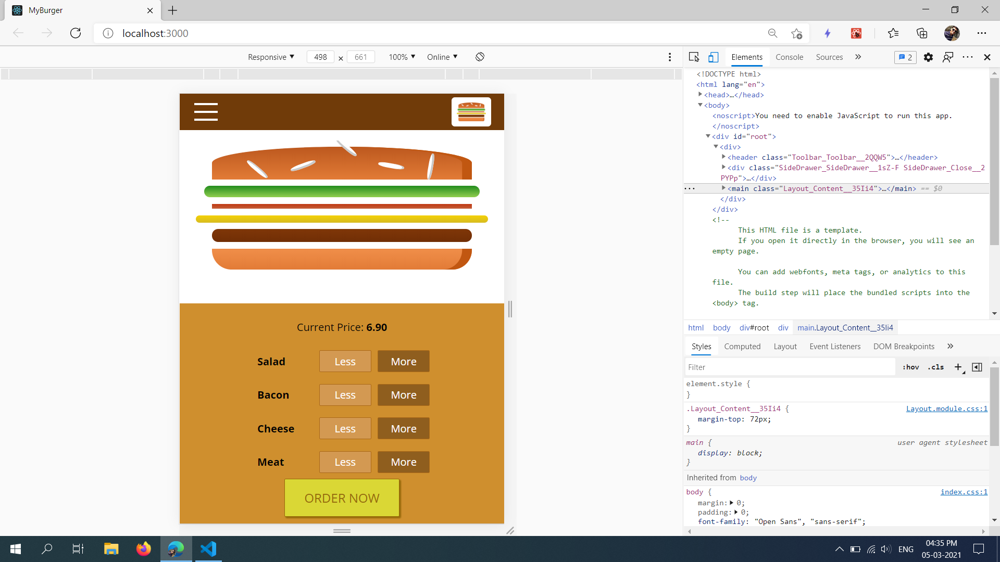
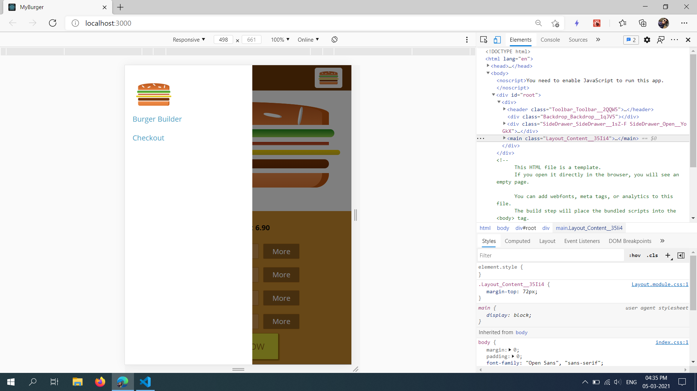

# Burger Builder - React App 

### `npm install`

Clone this repository

Type "npm intall" to install all dependencies from package.json

### `npm start`
Type "npm start" to run this project on local server

Open [http://localhost:3000](http://localhost:3000) to view it in the browser.

Screenshots of Burger-Builder

